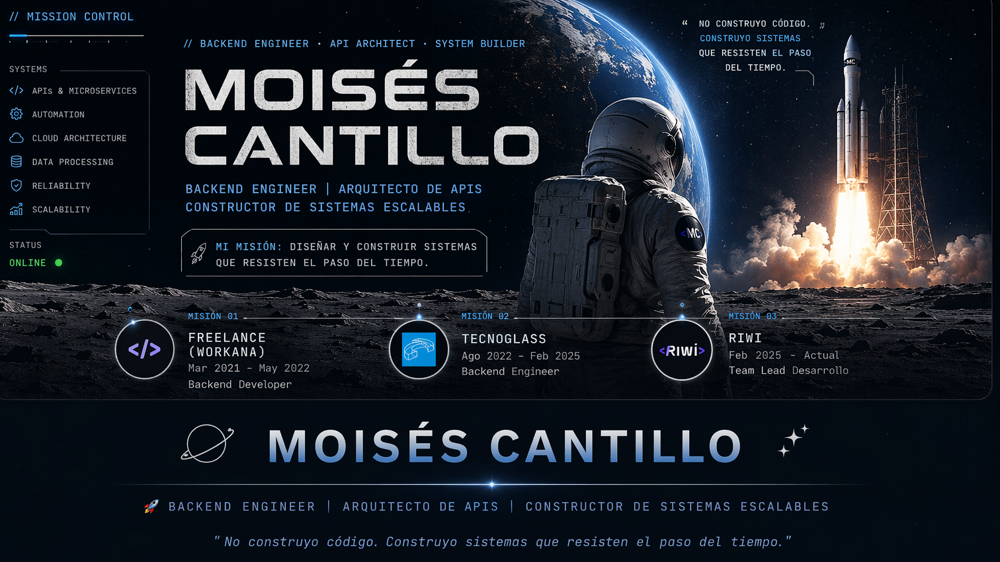

  

---

## 🌑 Misión Actual

En un entorno donde muchos sistemas fallan por mala arquitectura, mi enfoque es distinto:  
**construir backend sólido, escalable y preparado para crecer.**

Soy **Ingeniero de Sistemas** con +4 años de experiencia especializado en:

- ⚙️ Diseño de **APIs robustas y escalables**
- ☁️ Arquitectura en la nube (**AWS: EC2, S3, Lambda**)
- 🧩 **Microservicios** y sistemas distribuidos
- 🤖 Automatización y procesamiento de datos  

Actualmente combino **liderazgo técnico + ejecución**, formando talento mientras construyo soluciones reales.

---

## 🛰️ Stack Tecnológico

  
  
  
  
  
  
  
  

## 🧩 Ecosistema & Fullstack (Complementario)

 
 
 
 
 

## 🤖 Data & AI (Aplicado)

 
 
 

 

 
<i>Uso IA como herramienta para automatización, procesamiento de datos y mejora de sistemas backend.</i> 

---

## 🌕 Experiencia Profesional

### 🧑‍🚀 Team Lead — Riwi (2025 - Presente)
- Liderazgo técnico en formación de desarrolladores backend  
- Diseño de programas enfocados en **APIs y arquitectura**  
- Mentoría y evaluación de soluciones reales  
- Definición de estándares de calidad  

---

### 🛰️ Backend Engineer — Tecnoglass (2022 - 2025)
- Desarrollo de **APIs REST** con Django y Spring Boot  
- Migración de **monolito a microservicios**  
- Implementación en **AWS (EC2, S3, Lambda)**  
- Automatización y optimización de flujos de datos  
- Docker + CI/CD  

🧠 *Transición clave: de desarrollador a arquitecto de soluciones.*

---

### 🌌 Freelance Backend Developer (2021 - 2022)
- Desarrollo de APIs con Django Rest Framework  
- Web scraping y procesamiento de datos  
- Integración de sistemas  
- Gestión directa con clientes  

---

## 🪐 Proyecto Destacado

### 🌟 Plataforma de Gestión de Talento — Tecnoglass

Desarrollé una solución backend enfocada en:  
- Gestión del talento humano  
- Evaluación de desempeño  
- Toma de decisiones basada en datos  

✔️ APIs escalables  
✔️ Automatización de procesos  
✔️ Optimización de flujos críticos  

---

## 🌠 Enfoque de Ingeniería

No solo escribo código. Diseño sistemas con intención:

- 🧱 **Clean Architecture**
- 🔁 **Patrones de diseño**
- ⚡ **Escalabilidad desde el inicio**
- 🔍 Observabilidad y trazabilidad
- 🧠 Mantenibilidad como prioridad  

---

## 🎓 Educación

🎓 Ingeniería de Sistemas — Universidad de la Costa (2019 - 2024)

📜 Formación complementaria:
- Desarrollo Web — Universidad del Norte  
- Ingeniería de Software — Universidad del Norte  
- Docker — Devtalles  
- Inteligencia Artificial — Universidad Distrital  

---

## 🌍 Conecta conmigo

  
  

---

## ☕ Última señal

<i>
Construyo sistemas que no solo funcionan hoy,  
sino que siguen funcionando cuando el contexto cambia.  

Porque escalar no es suerte. Es diseño.
</i>

