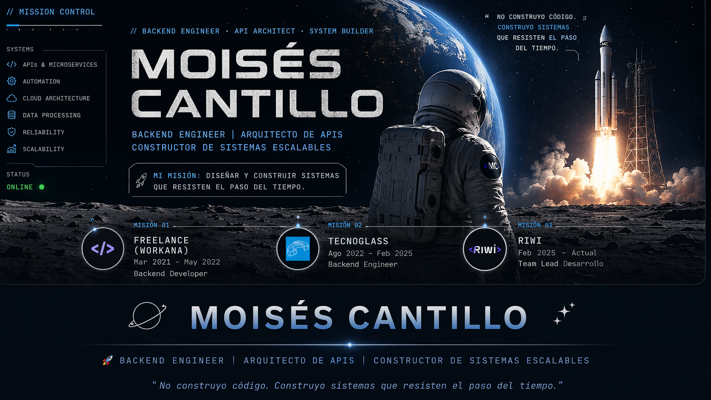

  

---

## 🌑 Misión Actual

En un entorno donde muchos sistemas fallan por mala arquitectura, mi enfoque es distinto:  
**construir software sólido, escalable, full-stack y preparado para crecer.**

Soy **Ingeniero de Sistemas** con +4 años de experiencia especializado en:

- ⚙️ Diseño de **APIs robustas y arquitecturas escalables**
- 💻 Desarrollo de punta a punta (**Ecosistema Full-Stack**)
- ☁️ Arquitectura en la nube (**AWS: EC2, S3, Lambda**)
- 🧩 **Microservicios** y sistemas distribuidos
- 🎥 Divulgación tecnológica y creación de contenido dev

Actualmente combino **liderazgo técnico + ejecución Full-Stack**, formando talento de alto nivel mientras construyo soluciones reales y comparto conocimiento con la comunidad.

---

## 🎥 Contenido & Comunidad (Mocadevia)

  

Además de construir sistemas, me apasiona la educación con un enfoque pragmático y sin rodeos. En mi canal de YouTube **[Mocadevia](https://www.youtube.com/@mocadevia)** comparto conocimiento real para devs, guiado por una regla clara: **fundamental de ingeniería sobre hype tecnológico.**

Aquí encontrarás:
* 🛠️ **Arquitectura y Desarrollo Real:** Tutoriales prácticos enfocados en crear software que resista el paso del tiempo.
* 📐 **Bases Sólidas:** Buenas prácticas, Clean Code y patrones de diseño aplicados a problemas del día a día.
* 🧠 **Pensar Primero, IA Después:** Uso consciente y con criterio de la Inteligencia Artificial. Enseño a dominar la lógica básica y las variables antes de delegar código a un modelo.
* 💼 **Crecimiento Profesional:** Consejos, análisis de entorno e historias reales sobre el ecosistema dev, sin filtros.

---

## 🛰️ Stack Tecnológico Principal (Backend & Cloud)

  
  
  
  
  
  
  
  

## 🧩 Ecosistema Full-Stack

   
   
   
   
   

## 🤖 Data & AI (Aplicado)

 
   

 

 
  <i>Uso IA como herramienta para automatización, procesamiento de datos y optimización de sistemas.</i> 

---

## 🌕 Experiencia Profesional

### 🧑‍🚀 Full-Stack Developer & Team Lead — Riwi (2025 - Presente)
- Liderazgo técnico y mentoría en la formación de desarrolladores.
- Desarrollo e implementación de soluciones robustas utilizando un enfoque **Full-Stack**.
- Diseño de arquitecturas orientadas a **APIs, microservicios y escalabilidad**.
- Definición de estándares de calidad de código y revisión de soluciones reales bajo producción.

---

### 🛰️ Backend Engineer — Tecnoglass (2022 - 2025)
- Desarrollo de **APIs REST** con Django y Spring Boot.
- Migración arquitectónica clave de **monolito a microservicios**.
- Implementación y despliegue en infraestructura de **AWS (EC2, S3, Lambda)**.
- Automatización y optimización de flujos de datos críticos mediante Docker + CI/CD.

🧠 *Transición clave: de desarrollador a arquitecto de soluciones.*

---

### 🌌 Freelance Backend Developer (2021 - 2022)
- Desarrollo de APIs rápidas y seguras con Django Rest Framework.
- Web scraping y arquitectura para procesamiento masivo de datos.
- Integración de sistemas externos y gestión directa con clientes internacionales.

---

## 🪐 Proyecto Destacado

### 🌟 Plataforma de Gestión de Talento — Tecnoglass

Desarrollé una solución robusta enfocada en:  
- Gestión centralizada del talento humano y evaluación de desempeño.
- Arquitectura preparada para la toma de decisiones basada en datos masivos.

✔️ APIs escalables de alta disponibilidad  
✔️ Automatización completa de flujos y procesos internos  
✔️ Optimización de procesamiento de consultas críticas  

---

## 🌠 Enfoque de Ingeniería

No solo escribo código. Diseño sistemas con intención:

- 🧱 **Clean Architecture & Clean Code** como bases innegociables.
- 🔁 **Patrones de diseño** orientados a objetos y arquitecturas distribuidas.
- ⚡ **Escalabilidad y rendimiento** planeados desde la primera línea.
- 🔍 Observabilidad, trazabilidad y tolerancia a fallos.

---

## 🎓 Educación

🎓 **Ingeniería de Sistemas** — Universidad de la Costa (2019 - 2024)

📜 Formación complementaria destacada:
- Desarrollo Web & Ingeniería de Software — Universidad del Norte  
- Docker y arquitecturas modernas — Devtalles  
- Inteligencia Artificial Aplicada — Universidad Distrital  

---

## 🌍 Conecta conmigo

  
  
  

---

## ☕ Última señal

<i>
Construyo sistemas que no solo funcionan hoy,  
sino que siguen respondiendo cuando el contexto y la carga cambian.  

Porque escalar no es suerte. Es diseño.
</i>

